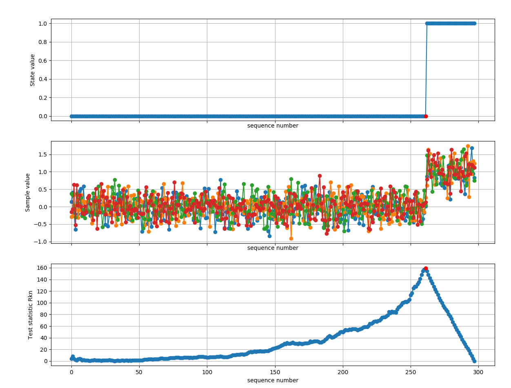

# change_point_detection
A python example of non-parametric multivariate change point detection algorithm. 

# References:
[1] Y. Li and S. K. Jayaweera, "Dynamic Spectrum Tracking Using Energy and Cyclostationarity-Based Multi-Variate Non-Parametric Quickest Detection for Cognitive Radios," in IEEE Transactions on Wireless Communications, vol. 12, no. 7, pp. 3522-3532, July 2013.
doi: 10.1109/TW.2013.060413.121814 Link: https://ieeexplore.ieee.org/document/6542774

[2] M. D. Holland, “A nonparametric change point model for multivariate
phase-II statistical process control,” Ph.D. dissertation, 2011.
https://experts.umn.edu/en/publications/a-control-chart-based-on-a-nonparametric-multivariate-change-poin
https://www.semanticscholar.org/paper/A-nonparametric-change-point-model-for-multivariate-Holland/b7da5bb7b2f91a1a0c6b9a2b8a0392488f9d88ab
http://www.mbswonline.com/upload/presentation_6-2-2011-8-20-36.pdf
