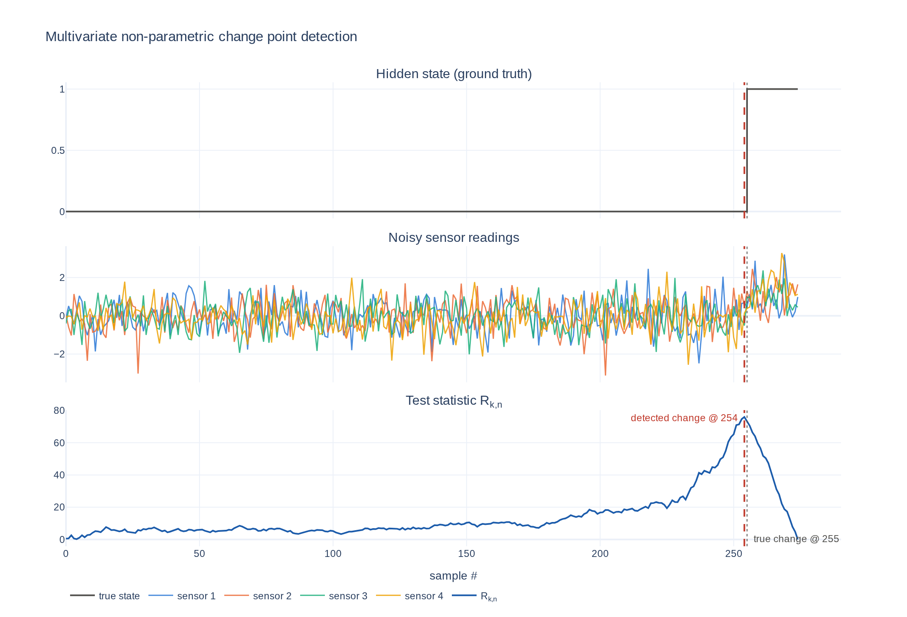

# Multivariate Non-Parametric Change Point Detection

[](https://yanglited.github.io/anomaly_change_point_detection/)
[](LICENSE)

[](https://pypi.org/project/qdetector/)

Detect **when** a multi-sensor signal changed, with no assumptions about the noise distribution.
Single file, ~100 lines, NumPy only. Useful for anomaly detection, statistical process control,
sensor fusion, and spectrum sensing.

**[▶ Open the interactive demo](https://yanglited.github.io/anomaly_change_point_detection/)** (hover, zoom, pan)



## Run it

```bash
pip install qdetector && qdetector        # from PyPI
# or, from a clone, with zero setup (uv fetches numpy + plotly):
uv run qdetector.py
```

Try a harder sequence or more noise:

```bash
qdetector --states 0,0,1,1,0 --sigma 1.2 --sensors 6 --seed -1
qdetector --html out.html       # save the interactive plot instead of opening it
```

## Use it on your data

```python
# pip install qdetector
import numpy as np
from qdetector import Qdetector

samples = np.loadtxt("sensors.csv", delimiter=",").T   # shape (num_sensors, num_samples)
det = Qdetector(samples)
cp = det.detect()          # index of the change point, or None if nothing detected
det.Rkn                    # the full test statistic, one value per sample
```

## How it works

We observe $n$ vectors $Z_1,\dots,Z_n \in \mathbb{R}^d$ (one entry per sensor). Question: did the
distribution change at some unknown time $k$?

$$H_0:\; Z_1,\dots,Z_n \sim F \qquad\text{vs}\qquad H_1:\; Z_1,\dots,Z_k \sim F,\; Z_{k+1},\dots,Z_n \sim G \ne F$$

We want to do this **without knowing $F$ or $G$**. The trick is to replace values with ranks.

### 1. Spatial ranks: a multivariate rank

In 1-D, the rank of $Z_i$ is (up to scaling) $\sum_j \operatorname{sign}(Z_i - Z_j)$. The
multivariate analogue uses the **spatial sign** $S(x) = x/\lVert x\rVert$, a unit vector:

$$R(Z_i) = \sum_{j \ne i} \frac{Z_i - Z_j}{\lVert Z_i - Z_j\rVert}$$

$R(Z_i)$ is a vector that points from the cloud toward $Z_i$. Its length is near 0 for a point in the
middle of the cloud and near $n$ for a point far outside it. Two properties carry everything:

- **It sums to zero:** $\sum_i R(Z_i) = 0$, because every pair contributes $u$ and $-u$.
- **It only uses directions,** never magnitudes. Translating, scaling or rotating the data, or
  replacing $F$ by any other distribution, does not change how the ranks behave under $H_0$.

### 2. The statistic: are the first $k$ ranks pulling one way?

If a change happened at $k$, the first $k$ points sit on one side of the cloud, so their ranks
all point roughly the same direction and their mean is far from zero. Define

$$\bar R_k = \frac{1}{k}\sum_{i=1}^{k} R(Z_i)$$

Under $H_0$ the $Z_i$ are exchangeable, so $\{R(Z_1),\dots,R(Z_n)\}$ is a fixed set of $n$ vectors
summing to zero and the first $k$ are a **random sample of size $k$ without replacement** from it.
Elementary finite-population sampling gives, exactly and for any $F$,

$$\mathbb{E}[\bar R_k] = 0, \qquad
\operatorname{Cov}(\bar R_k) = \Sigma_k = \frac{n-k}{(n-1)\,n\,k}\sum_{i=1}^{n} R(Z_i)R(Z_i)^{\mathsf T}$$

(the familiar $\frac{N-k}{k(N-1)}\sigma^2$ correction, with the population variance written out).
Standardise the mean by its own covariance, a Mahalanobis distance:

$$R_{k,n} = \bar R_k^{\mathsf T}\,\Sigma_k^{-1}\,\bar R_k$$

Under $H_0$, $\bar R_k$ is a sum of many bounded terms, so $R_{k,n} \approx \chi^2_d$ for every $k$:
a flat line at height about $d$. Under $H_1$ it peaks at the true change, because $\bar R_k$ grows
while $\Sigma_k$ does not. Hence

$$\hat k = \arg\max_k R_{k,n}$$

$k = n$ is excluded: $\Sigma_n = 0$ and the "sample" is the whole population.

### 3. Why it works when parametric methods don't

- **Distribution-free.** Every step in §2 conditions on the observed ranks; nothing about $F$ was
  used. The null distribution is the same for Gaussian, uniform, or heavy-tailed noise.
- **Robust.** Each $S(\cdot)$ has norm 1, so an outlier can move a rank by at most $1$, not by its
  magnitude.
- **Truly multivariate.** $\Sigma_k^{-1}$ accounts for correlated sensors; a change that is tiny on
  each sensor but consistent across them still produces a large $\bar R_k$.
- **Affine invariant** up to rotation and scale, so sensors in different units can be mixed.

### 4. The decision rule in the code

The principled rule is: declare a change if $\max_k R_{k,n}$ exceeds a threshold $h$, where $h$ is
chosen for a target false-alarm rate (by simulation or by permuting the sample). `qdetector.py`
uses a cheaper proxy:

$$\frac{\operatorname{Var}_k(R_{k,n})}{\operatorname{Mean}_k(R_{k,n})} \ge 3$$

Under $H_0$ the curve is roughly $\chi^2_d$ everywhere, so variance $\approx 2d$ and mean
$\approx d$: the ratio sits near $2$. A genuine change produces a sharp peak that inflates the
variance much faster than the mean, pushing the ratio well past $3$. It is a heuristic, not a test
with a stated size; replace it with a calibrated $h$ if you need a controlled false-alarm rate.

### 5. Cost

Computing all pairwise spatial signs is $O(d\,n^2)$ time and memory. The quadratic form for all
$k$ is $O(d^2 n)$ once $\sum_i R R^{\mathsf T}$ is known, since $\Sigma_k$ is that one matrix times
a scalar. Fine for thousands of samples; for streaming use, run it on a sliding window.

## References

1. Y. Li and S. K. Jayaweera, *"Dynamic Spectrum Tracking Using Energy and Cyclostationarity-Based
   Multi-Variate Non-Parametric Quickest Detection for Cognitive Radios,"* IEEE Transactions on
   Wireless Communications, vol. 12, no. 7, pp. 3522–3532, July 2013.
   [doi:10.1109/TW.2013.060413.121814](https://doi.org/10.1109/TW.2013.060413.121814)
2. M. D. Holland, *"A nonparametric change point model for multivariate phase-II statistical
   process control,"* Ph.D. dissertation, University of Minnesota, 2011.
   [experts.umn.edu](https://experts.umn.edu/en/publications/a-control-chart-based-on-a-nonparametric-multivariate-change-poin) ·
   [Semantic Scholar](https://www.semanticscholar.org/paper/b7da5bb7b2f91a1a0c6b9a2b8a0392488f9d88ab)

If this helped your work, please cite [1] and star the repo.

## License

MIT
